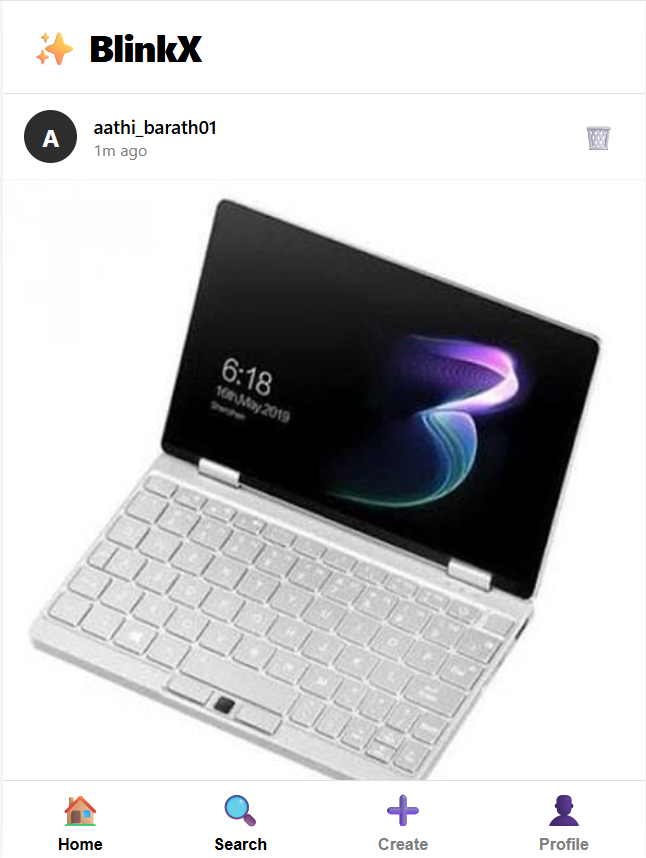
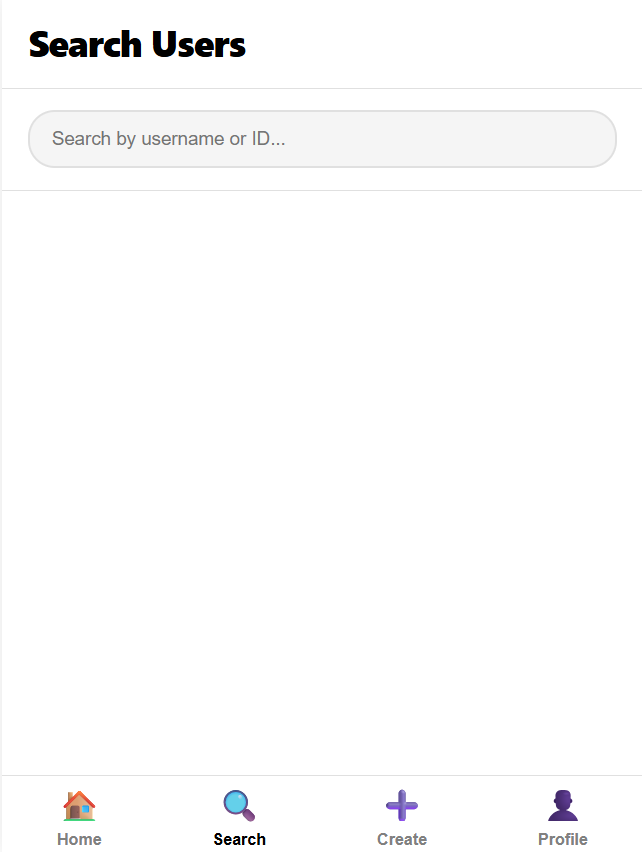
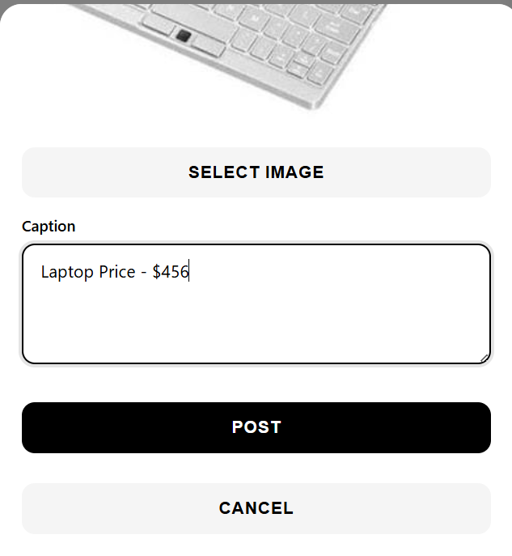
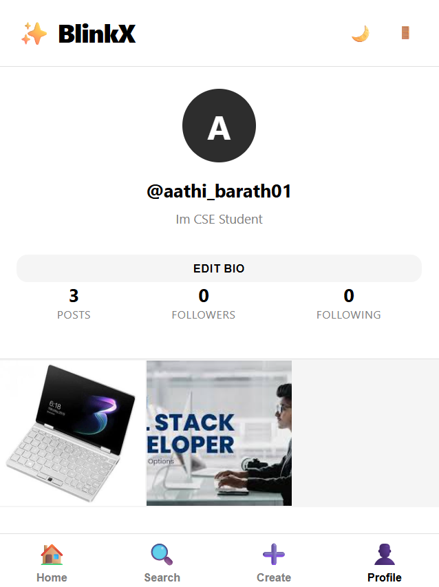
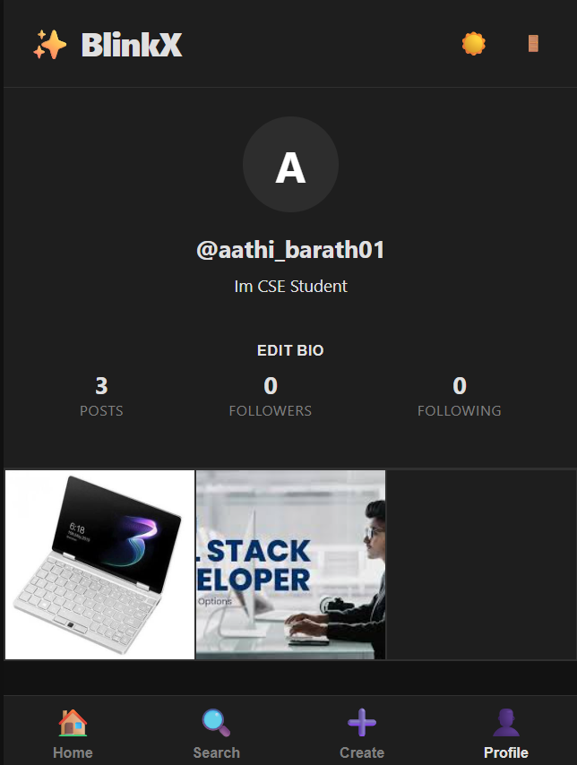

# BlinkX - Simple Social Media Platform

A lightweight and responsive social media web application built using HTML, CSS, and JavaScript. BlinkX demonstrates the core functionality of a social networking platform with a clean, mobile-first interface.

## 🌐 Live Demo

🔗 https://blinkcart-uq1w.onrender.com


## Overview

BlinkX was developed as part of my **CodeAlpha Full Stack Development Internship** to practice frontend development and build an interactive web application.

The project focuses on creating a simple social media experience where users can register, log in, create posts, interact with content, and manage their profile.

## Features

### User Management

* User Registration
* User Login
* Profile Management
* Follow / Unfollow Users

### Content

* Create Posts
* Upload Images
* Like Posts
* Comment on Posts

### Interface

* Mobile-First Responsive Design
* Clean Black & White Theme
* Smooth Navigation
* Interactive User Interface

## Tech Stack

### Frontend

* HTML5
* CSS3
* JavaScript (ES6)

### Storage

* Browser LocalStorage

## Project Structure

```text
BlinkX/
├── screenshots/
├── index.html
├── styles.css
├── app.js
└── README.md
```

## Getting Started

### Clone Repository

```bash
git clone https://github.com/Aathibarath/blinkX.git
cd blinkX
```

### Run the Project

Open `index.html`

or

Run the project using the **Live Server** extension in Visual Studio Code.

## Application Screenshots

| Home                       | Search                      |
| -------------------------- | --------------------------- |
|  |  |

| Create Post               | Profile                      |
| ------------------------- | ---------------------------- |
|  |  |

| Dark Theme                     |
| ------------------------------ |
|  |

## Features Implemented

* User Authentication
* Post Creation
* Like Functionality
* Comment System
* Follow / Unfollow
* User Profile
* Mobile Responsive Layout
* Local Data Storage

## Future Improvements

* Backend Integration
* Database Support
* Real-time Chat
* Notifications
* Search Improvements
* Dark / Light Theme Toggle
* Image Optimization

## License

MIT License

## Author

**Aadhi Barath**

B.Tech Computer Science Engineering

GitHub: https://github.com/Aathibarath

---

**BlinkX** is a simple social media web application created to practice frontend development concepts, responsive UI design, and interactive user experiences.
